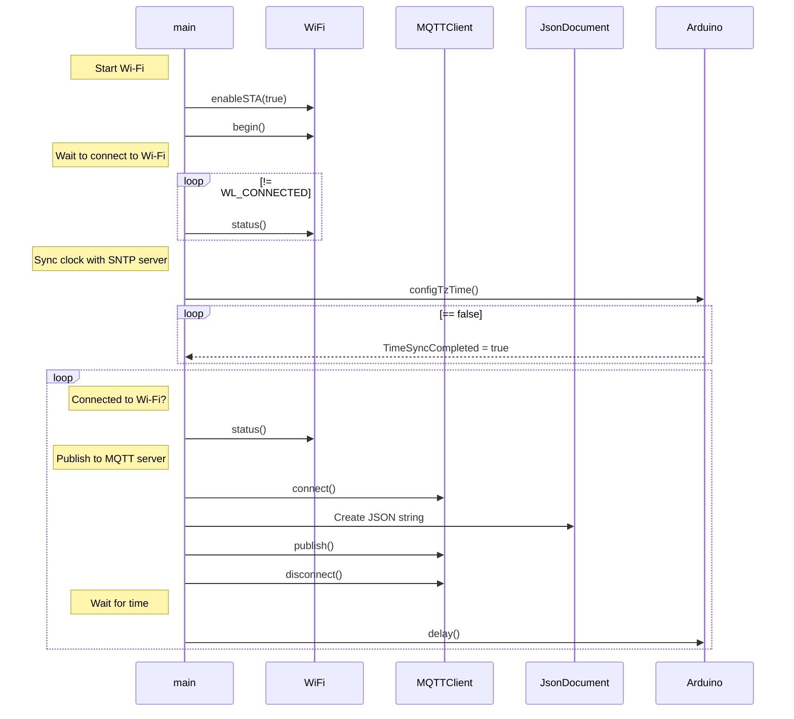

# ESP32_C3_Network_Example
Seeed Studio  Xiao ESP32-c3

# MQTT

```mermaid
sequenceDiagram
    participant main
    participant WiFi
    participant MQTTClient
    participant JsonDocument
    participant Arduino

    note left of main: Start Wi-Fi
    main->>WiFi: enableSTA(true)
    main->>WiFi: begin()

    note left of main: Wait to connect to Wi-Fi
    loop != WL_CONNECTED
      main->>WiFi: status()
    end

    note left of main: Sync clock with SNTP server
    main->>Arduino: configTzTime()
    loop == false
      Arduino-->>main: TimeSyncCompleted = true
    end

    loop
      note left of main: Connected to Wi-Fi?
      main->>WiFi: status()

      note left of main: Publish to MQTT server
      main->>MQTTClient: connect()
      main->>JsonDocument: Create JSON string
      main->>MQTTClient: publish()
      main->>MQTTClient: disconnect()

      note left of main: Wait for time
      main->>Arduino: delay()
    end
```
